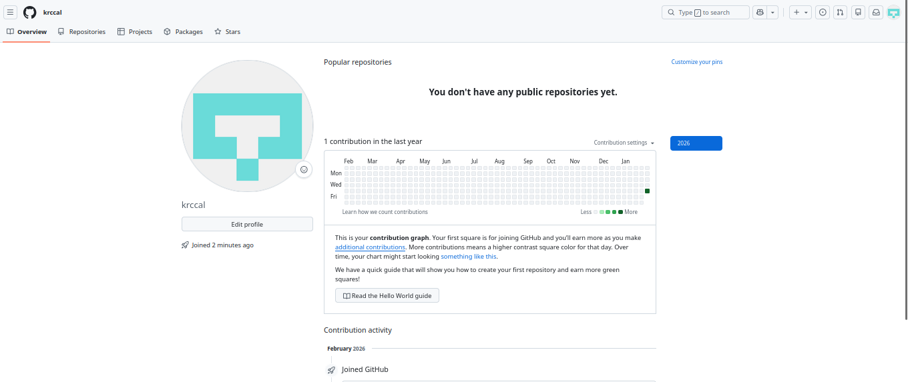

# INSTALACION DE GIT EN UBUNTU  Y CREACIÓN DE UNA CUENTA EN GITHUB
# Instalando GIT como entorno de desarrollo

## Instalación

Ejecuta el siguiente comando:

```sh
apt-get install git
```

**Nota:** Si requieres permisos de administrador, utiliza `sudo`:

```sh
sudo apt install git
```

## Verificar la instalación

Comprueba la versión instalada:

```sh
git --version
```

Deberías ver la versión de Git instalada en tu sistema.

---

# Creación de una cuenta en GitHub

## Acceder a GitHub

Dirígete a [https://github.com](https://github.com)

## Registrarse con correo electrónico


## Completar datos de registro


## Confirmar correo electrónico

GitHub enviará un código de verificación a tu correo. Ingresa el código para completar el registro.


## Acceder a tu cuenta

¡Listo! Ahora puedes iniciar sesión con tu usuario y contraseña.



