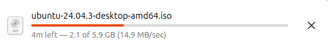
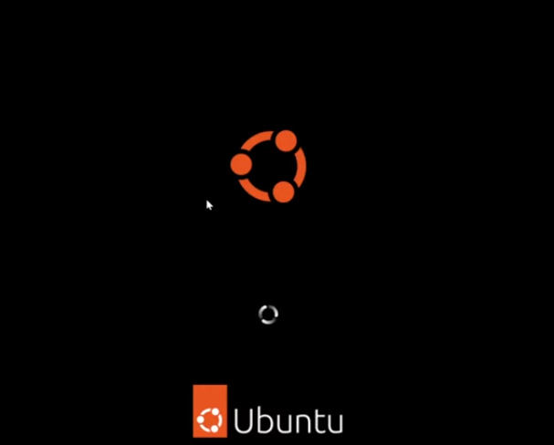
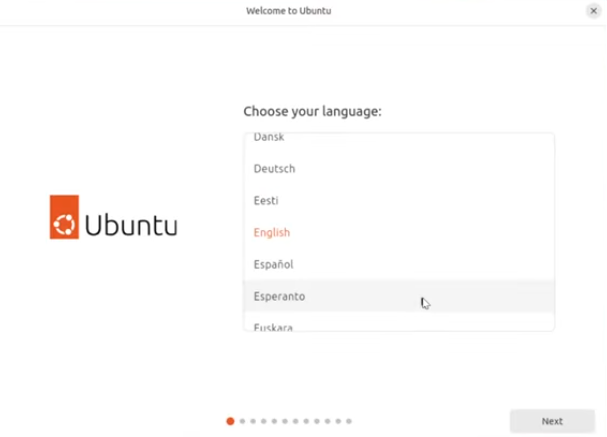
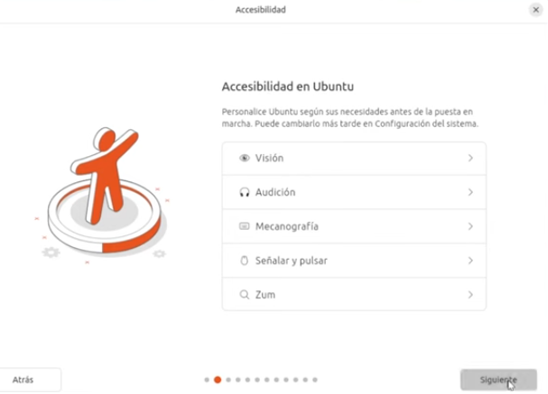
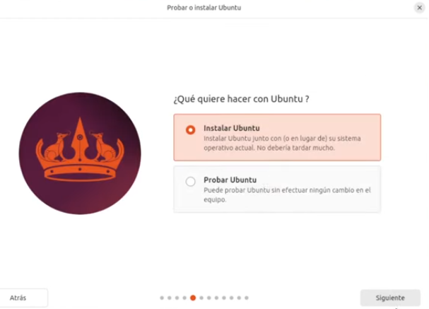
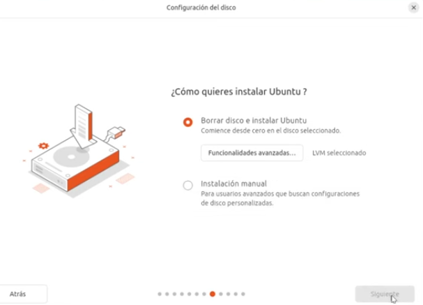
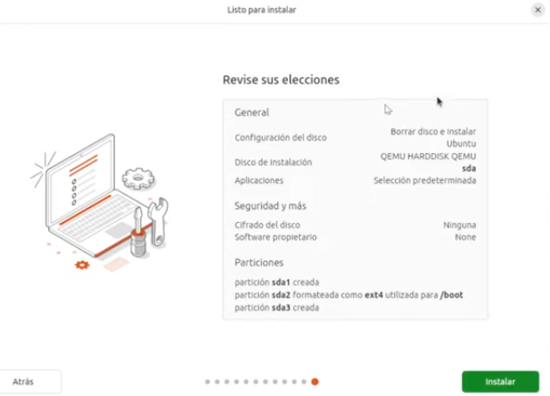
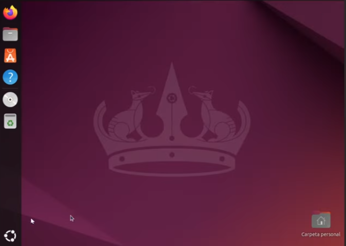

# Guia de instalación de Ubuntu 24.04 LTS

## Requisitos mínimos del sistema para Ubuntu 24.04 LTS

- **Arquitectura:** Intel o AMD 64-bit
- **RAM:** 4 GB (recomendado) o 2 GB (mínimo)
- **Procesador:** Dual core con frecuencia de 2 GHz o superior
- **Disco duro:** 25 GB como mínimo
- **Unidad de instalación:** DVD o puerto USB 
- **Conexión a internet:** Recomendado para descargas de actualizaciones

# Instalación

- Paso 1: Descargar el archivo ISO de Ubuntu actualizado o utilizar un CD/DVD

- Paso 2: Crear un USB de arranque

  - En Windows, utiliza Rufus para crear un USB booteable con la imagen ISO de Ubuntu.
  - En macOS, utiliza Balena Etcher o UNetbootin para crear un USB booteable de forma gráfica.

- Paso 3: Arranque desde USB/DVD

- Paso 4: Con la computadora apagada, inserta el USB o DVD de arranque. Enciende la computadora y aparecerá la terminal de GNU presionar en "Try or install Ubuntu"

Se iniciara Ubuntu

- Paso 5: Después seleccionamos el idioma del sistema.

- Paso 6: Presiona "siguiente" 

- Paso 7: Elegimos el idioma del teclado. 

- Paso 8: Presiona en "instalar Ubuntu"

- Paso 9: Presionamos en siguiente

- Paso 10: Elegimos como instalar Ubuntu

- Paso 11: Crea tu cuenta

- Paso 12: Revisa la pantalla de confirmacion de datos de la instalacion. Presiona **instalar** y reinicia la computadora.

Listo tienes a Ubuntu listo para inicializar.

 